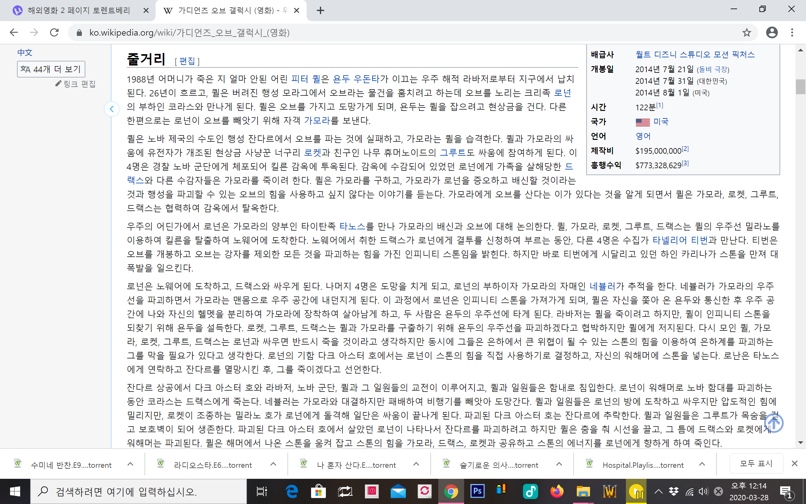

# manuals_test

깃허브 최초 협업 실습입니다.

팀원과 함께 작성해보아요.

## 앞에 녹색 바는 왜 나올까요

### .md 는 마크다운 파일

---

**마크다운** 문법을 ***써***봅니다.

+ 원격 저장소 ~~만들기~~
  - origin 연결하기
  - push
    + pull vs fetch
      * pull
      * fetch
      
 > 레츠기릿 인용문타임
 >> 인용문 안에 인용문
 
 #### 소스코드는 `백 코트를` 사용하세요
 
 `function add(x,y) {return x + y;}`
 
 ##### 여러줄의 소스코드는 ```백 코트 세개``` 와 뒤에 jaascript 나 python 같은 프로그래밍 언어를 붙여주세요
 
 ---
 
 ``` html
<html>
  <a href="http://google.com">google</a>
</html>
```

##### 링크

---

[구글](https://google.com, "검색사이트")

<https://google.com>


- - -

***

* * *

*****

# 이미지 링크


